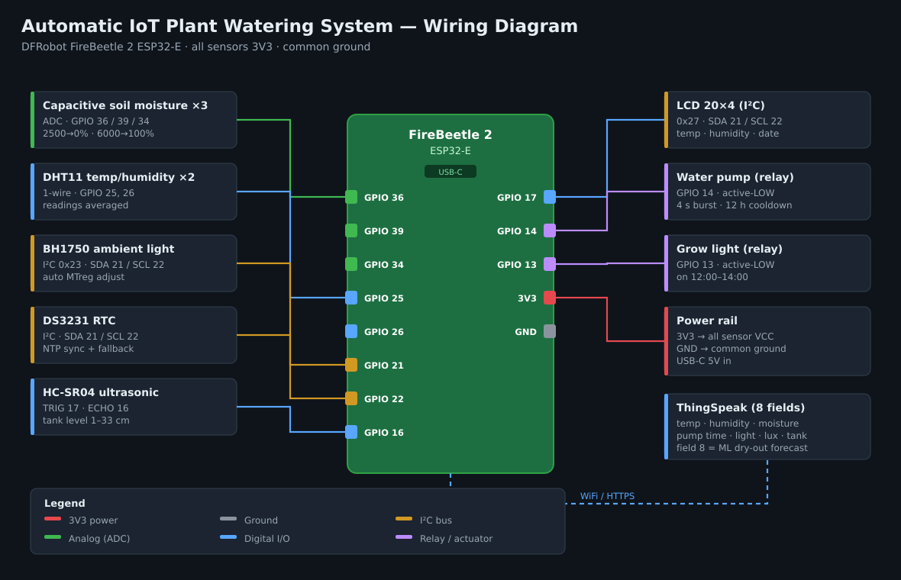

# Automatic IoT Plant Watering System

[](https://github.com/JWhite212/Automatic-IOT-Plant-Watering-System/actions/workflows/platformio.yml)
[](LICENSE)

An ESP32-based automated plant care controller that monitors soil moisture, ambient temperature and humidity, light level, and water-tank level, then drives a water pump and grow light accordingly. A small on-device logistic-regression model forecasts how likely the soil is to dry out in the next few hours. Sensor data is logged to [ThingSpeak](https://thingspeak.com/) and a local 20×4 LCD displays live readings. The firmware is written in Arduino C++ and built with PlatformIO.

## Features

- **Multi-sensor monitoring** — 3× capacitive soil-moisture probes, 2× DHT11 temperature/humidity sensors, BH1750 ambient-light sensor, HC-SR04 ultrasonic water-tank level sensor.
- **Automated watering** — soil-moisture threshold trigger with a configurable inter-watering cooldown and an empty-tank safety cutoff that protects the pump.
- **On-device dry-out forecast** — a logistic-regression model runs on the ESP32 each measurement cycle and publishes the probability that the soil will need water within the next 6 hours. No cloud inference, no ML runtime. See [On-device machine learning](#on-device-machine-learning).
- **Scheduled grow-light control** — on/off hours enforced against the DS3231 RTC, with NTP sync when WiFi is available.
- **Live LCD status** — 20×4 I²C LCD shows current temperature, humidity, and date/time.
- **Cloud telemetry** — temperature, humidity, soil moisture, pump activity, light activity, lux, water-tank level, and the dry-out forecast published to ThingSpeak on a 30-second cadence.
- **Cooperative scheduling** — all sensor reads, actuator control, and network I/O run as non-blocking tasks via [TaskScheduler](https://github.com/arkhipenko/TaskScheduler).
- **Credentials stay out of source** — WiFi credentials and ThingSpeak API keys are loaded from ESP32 `Preferences` (NVS) at boot; nothing sensitive is compiled into the firmware.
- **Resilient timekeeping** — NTP sync over WiFi with DS3231 RTC fallback after WiFi loss or power cycles.
- **Unit-tested control logic** — calibration, gating and model inference are pure functions covered by host-side Unity tests and run in CI.

## Hardware

Target microcontroller: **DFRobot FireBeetle2 ESP32-E**.



| Component | Interface | Pin(s) |
|-----------|-----------|--------|
| Capacitive soil moisture ×3 | ADC | GPIO 36, 39, 34 |
| DHT11 temperature/humidity ×2 | 1-wire | GPIO 25, 26 |
| BH1750 ambient light | I²C (0x23) | SDA 21 / SCL 22 |
| DS3231 RTC | I²C | SDA 21 / SCL 22 |
| LiquidCrystal_I2C 20×4 display | I²C (0x27) | SDA 21 / SCL 22 |
| HC-SR04 ultrasonic (water tank) | Digital | TRIG 17, ECHO 16 |
| Water pump (via relay) | Digital out, active-LOW | GPIO 14 |
| Grow light (via relay) | Digital out, active-LOW | GPIO 13 |

All sensors run from the board's regulated 3V3 rail and share a common ground.

## Architecture

The firmware is a single cooperative scheduler loop. On boot, `setup()` loads credentials from NVS, brings up WiFi, initialises each sensor, and starts the scheduler. Periodic tasks then run without blocking:

- `tReadDHT` / `tSensor1` / `tSensor2` read temperature and humidity from both DHT11s and average the two readings.
- `tReadMoisture` polls the three soil probes, maintains a moving average, refreshes the dry-out forecast, and triggers `tPump` when the average falls below the threshold — subject to the cooldown and tank-level guards.
- `tReadBH1750` reads ambient light and adjusts the BH1750 integration time (MTreg) for the current light environment.
- `tReadUltrasonic` measures distance to the water surface and converts it into a tank percentage.
- `tScreen` refreshes the LCD.
- `tWifiCheck` publishes the latest telemetry to ThingSpeak every 30 seconds.
- `tTicker` orchestrates the above on a 10-second tick.

## On-device machine learning

A logistic-regression classifier estimates **P(soil drops below the pump threshold within the next 6 hours)** from the current sensor snapshot. It lives in `lib/MoistureML/` and runs entirely on the ESP32 — inference is a five-term dot product plus a sigmoid, so it costs microseconds and adds no runtime dependencies.

### Feature vector

| # | Feature | Source |
|---|---------|--------|
| 0 | `moisturePct` | Moving average of the three soil probes |
| 1 | `temperatureC` | Mean of both DHT11s |
| 2 | `humidityPct` | Mean of both DHT11s |
| 3 | `log1p(luxRaw)` | BH1750 moving average |
| 4 | `hoursSinceWater` | RTC time minus last pump activation |

Features are standardised with means and standard deviations baked into `lib/MoistureML/MoistureMLModel.h`, then combined with the trained coefficients.

### How the forecast is used

The forecast is **advisory**. The moisture threshold, the 12-hour cooldown, and the tank-level cutoff still own the decision to actually run the pump — a model artefact can never open the valve on its own. The probability is logged to serial and published to **ThingSpeak field 8** so watering behaviour can be correlated against the forecast over time.

### Retraining

```bash
pip install numpy scikit-learn

# Fit against exported ThingSpeak telemetry
python scripts/train_logistic_regression.py --csv data.csv

# Or regenerate from physically-plausible synthetic data
python scripts/train_logistic_regression.py
```

The script writes `lib/MoistureML/MoistureMLModel.h`, which is committed so a fresh clone builds without Python. CSV columns: `moisture_pct`, `temperature_c`, `humidity_pct`, `lux`, `hours_since_water`, `needs_water_within_6h`.

## Getting started

### Prerequisites

- [PlatformIO Core](https://platformio.org/install) (or the VS Code extension)
- A DFRobot FireBeetle2 ESP32-E wired per the table above
- A [ThingSpeak](https://thingspeak.com/) channel with 8 fields

### Build & upload

```bash
pio run -e dfrobot_firebeetle2_esp32e -t upload
```

PlatformIO auto-detects the serial port. If you need to specify one:

```bash
pio run -e dfrobot_firebeetle2_esp32e -t upload --upload-port /dev/ttyUSB0
```

### First-boot provisioning

All credentials live in the ESP32 NVS partition under the `credentials` namespace — none of them are compiled into the firmware. Use a one-off provisioning sketch (or temporarily add a `preferences.putString(...)` block to `setup()` and flash once) to store:

| Key | Type | Value |
|-----|------|-------|
| `ssid` | String | WiFi SSID |
| `password` | String | WiFi password |
| `tsChannel` | ULong | ThingSpeak channel ID |
| `tsWriteKey` | String | ThingSpeak write API key |
| `tsReadKey` | String | ThingSpeak read API key |

Example provisioning snippet:

```cpp
#include <Preferences.h>
Preferences preferences;

void setup() {
  preferences.begin("credentials", false);
  preferences.putString("ssid", "your-wifi-ssid");
  preferences.putString("password", "your-wifi-password");
  preferences.putULong("tsChannel", 1234567UL);
  preferences.putString("tsWriteKey", "YOUR_WRITE_KEY");
  preferences.putString("tsReadKey", "YOUR_READ_KEY");
  preferences.end();
}

void loop() {}
```

Flash once, then flash the real firmware. The credentials survive reboots and reflashes of the application code.

## Testing

Control logic that doesn't touch hardware lives in `lib/MoistureMath/` and `lib/MoistureML/` so it can be exercised on the host with [Unity](https://docs.platformio.org/en/latest/advanced/unit-testing/frameworks/unity.html):

```bash
pio test -e native
```

The suite covers ADC→percentage calibration and its clamping behaviour, ultrasonic distance→tank-percentage conversion, the pump cooldown and tank-level guards (including a clock-skew guard), the rolling-average filter, and the model's output range plus its monotonicity in each feature.

Every push and pull request runs both the firmware build and the native test suite — see [`.github/workflows/platformio.yml`](.github/workflows/platformio.yml).

## Configuration

Tunable parameters in `src/main.cpp`:

| Constant | Purpose | Default |
|----------|---------|---------|
| `moistureThreshold` | Averaged soil-moisture % below which the pump may trigger | 35 |
| `PUMP_COOLDOWN_HOURS` | Minimum hours between waterings | 12 |
| `MIN_WATER_TANK_PERCENT` | Pump is inhibited below this tank level | 5 |
| `MOISTURE_ADC_ZERO_PCT` / `MOISTURE_ADC_FULL_PCT` | Calibration ADC endpoints mapped to 0 % / 100 % soil moisture | 2500 / 6000 |
| `WATER_TANK_FULL_CM` / `WATER_TANK_EMPTY_CM` | Distance-from-sensor calibration for tank level | 1 / 33 |
| `OnHour` / `OffHour` | Grow-light window (24 h) | 12:00 – 14:00 |
| `TEMP_UPPER_THRESHOLD` / `HUM_UPPER_THRESHOLD` | Upper alert thresholds | 25 / 25 |
| `TEMP_LOWER_THRESHOLD` / `HUM_LOWER_THRESHOLD` | Lower alert thresholds | 12 / 12 |

Model parameters live in `lib/MoistureML/MoistureMLModel.h` (`MOISTURE_ML_HORIZON_HOURS`, `MOISTURE_ML_THRESHOLD`).

## Project layout

```
.
├── .github/workflows/
│   └── platformio.yml        # CI: firmware build + native unit tests
├── docs/
│   └── wiring-diagram.svg    # Hardware wiring reference
├── include/                  # Reserved for future header split
├── lib/
│   ├── MoistureMath/         # Calibration + pump-gating maths (native-testable)
│   ├── MoistureML/           # Logistic-regression forecast + generated model header
│   └── ...                   # Vendored Arduino libraries pinned to known-good versions
├── scripts/
│   └── train_logistic_regression.py  # Regenerates MoistureMLModel.h
├── src/
│   └── main.cpp              # Firmware entry point and all tasks
├── test/
│   ├── test_native_moisture_math/
│   └── test_native_moisture_ml/
├── platformio.ini            # PlatformIO build config
└── README.md
```

## Roadmap

Ideas for future iterations, not yet implemented:

- Web dashboard for sensor history and manual overrides
- Mobile push notifications on low tank, sensor failure, or watering events
- Retrain the dry-out model on a full season of logged telemetry and evaluate it against a held-out split
- PID-based climate control combining fan, heater, and grow light
- 3D-printable enclosure
- Hardware-in-the-loop tests for the sensor drivers

## License

[MIT](LICENSE)
